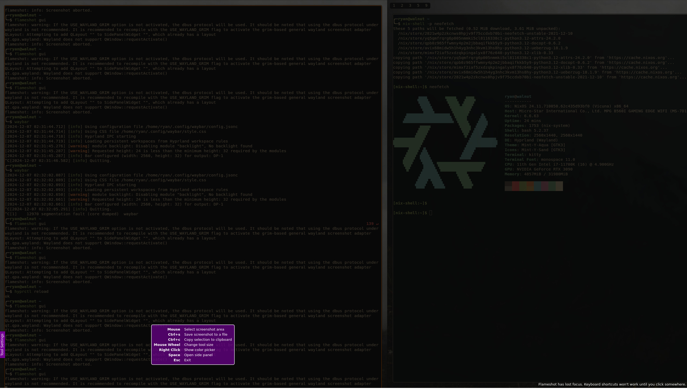
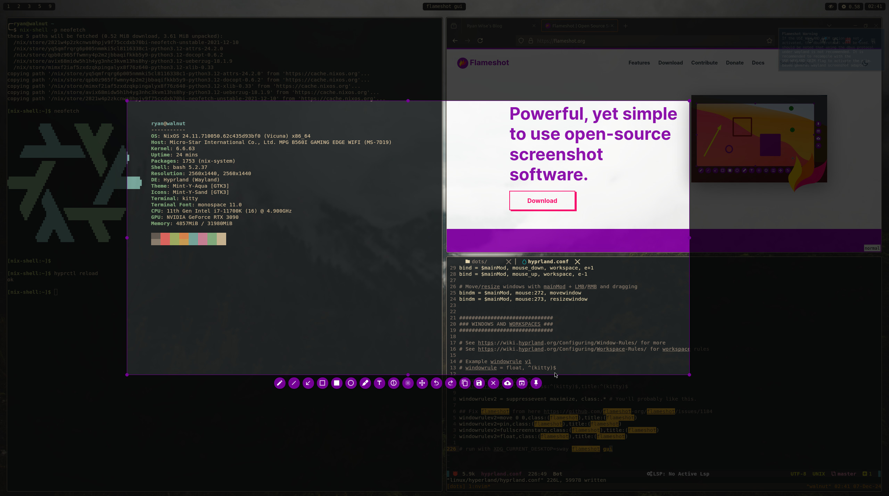

+++
author = "Ryan Wise"
categories = ["Linux"]
tags = ["nixos", "hyprland"]
date = "2024-12-07"
description = "Flameshot doesn't play well with hyprland out of the box, let's fix that"
featuredalt = "flameshot logo"
featuredpath = "assets/img/posts/flameshot-on-hyprland"
featured = "flameshot.png"
linktitle = ""
title = "Fixing flameshot on Hyprland"
type = "post"

+++

## The Problem
When running flameshot under hyprland I ran into an issue where with multiple monitors it would obscure the view while running. As you can see in the following example, my main monitor displays my half left monitor's content and half my main monitor's content. 



Luckily I found a good solution on this [Github issue](https://github.com/flameshot-org/flameshot/issues/1184#issuecomment-2061248357) that worked for me after some tweaks. The original solution doesn't work on the current version of hyprland as fakefullscreen was replaced in [v0.42](https://github.com/hyprwm/Hyprland/releases/tag/v0.42.0)
```
# hyprland.conf
windowrulev2=move 0 0,class:(flameshot),title:(flameshot)
windowrulev2=pin,class:(flameshot),title:(flameshot)
windowrulev2=fakefullscreen,class:(flameshot),title:(flameshot)
windowrulev2=float,class:(flameshot),title:(flameshot)
```

Thankfully can use fullscreenstate instead to get the same effect 
```
# hyprland.conf
windowrulev2=move 0 0,class:(flameshot),title:(flameshot)
windowrulev2=pin,class:(flameshot),title:(flameshot)
windowrulev2=fullscreenstate,class:(flameshot),title:(flameshot)
windowrulev2=float,class:(flameshot),title:(flameshot)
```

Now we can run the following command and Hyprshot will work as intended. The original comment suggested running this with `XDG_CURRENT_DESKTOP=sway` set but I found no difference. Give it a shot if it's not working for you
```bash
flameshot gui
# or
XDG_CURRENT_DESKTOP=sway flameshot gui
```


## How does the solution work
When flameshot gui runs hyprland tries to give it a pane on the desktop. This causes your windows to be shuffled and cut off. The way around this is by manually setting the window rules to move it out of the way and not take up space as a pane.

Let's walk through the rules with comments.
```
# moves the window to x0, y0 on the screen
windowrulev2=move 0 0,class:(flameshot),title:(flameshot)
# shows the window on all workspaces
windowrulev2=pin,class:(flameshot),title:(flameshot)
# tell the application it's in fullscreen mode
windowrulev2=fullscreenstate,class:(flameshot),title:(flameshot)
# force the window to be floating ( not in a tiled pane )
windowrulev2=float,class:(flameshot),title:(flameshot)
```

There's more information available on these rules in the [hyprland wiki](https://wiki.hyprland.org/Configuring/Window-Rules/).