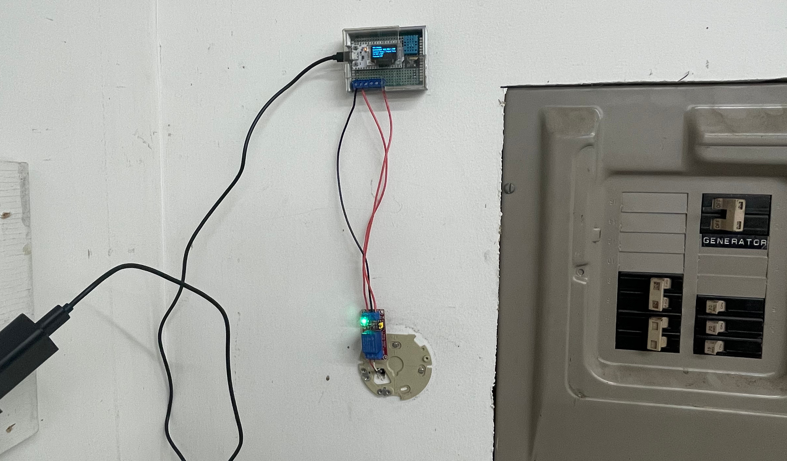
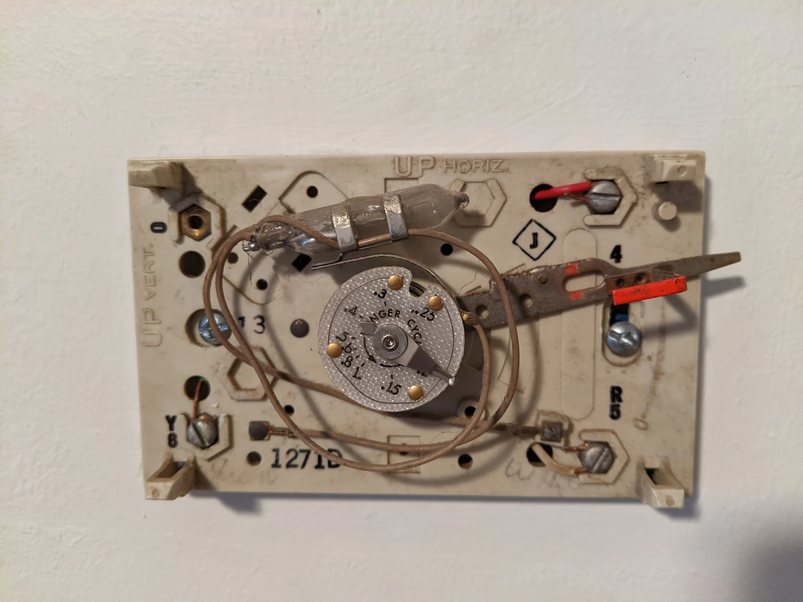
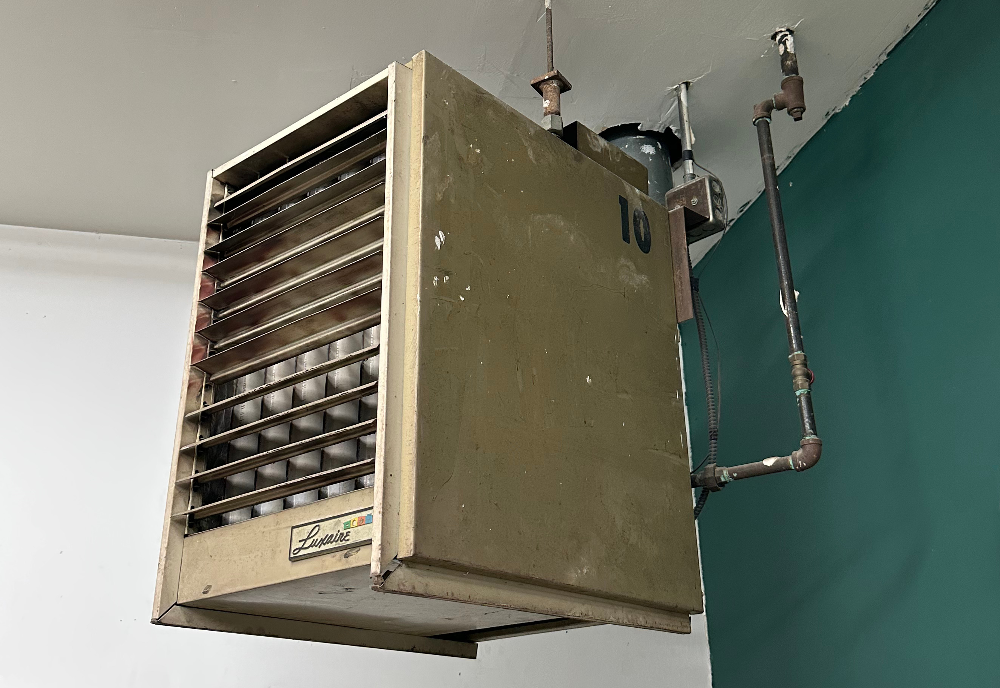
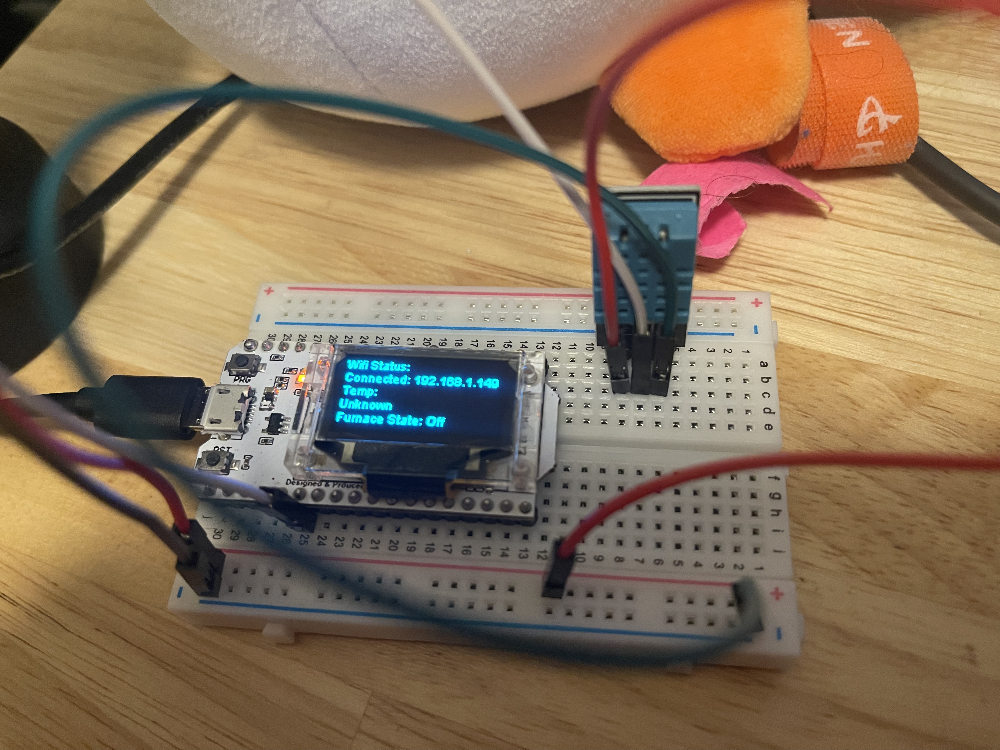
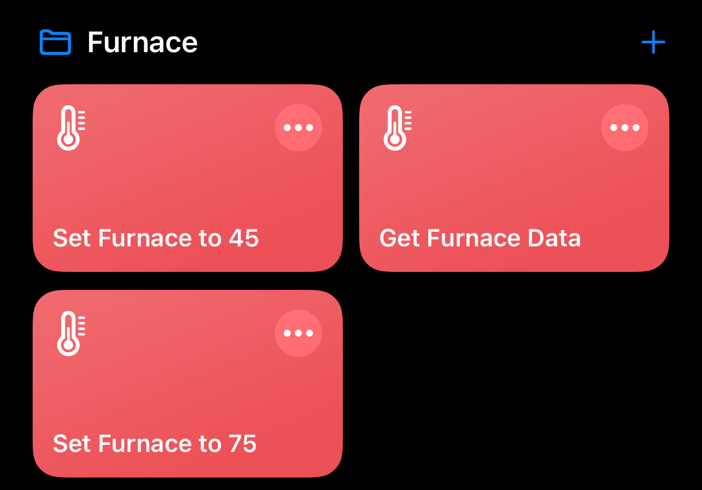
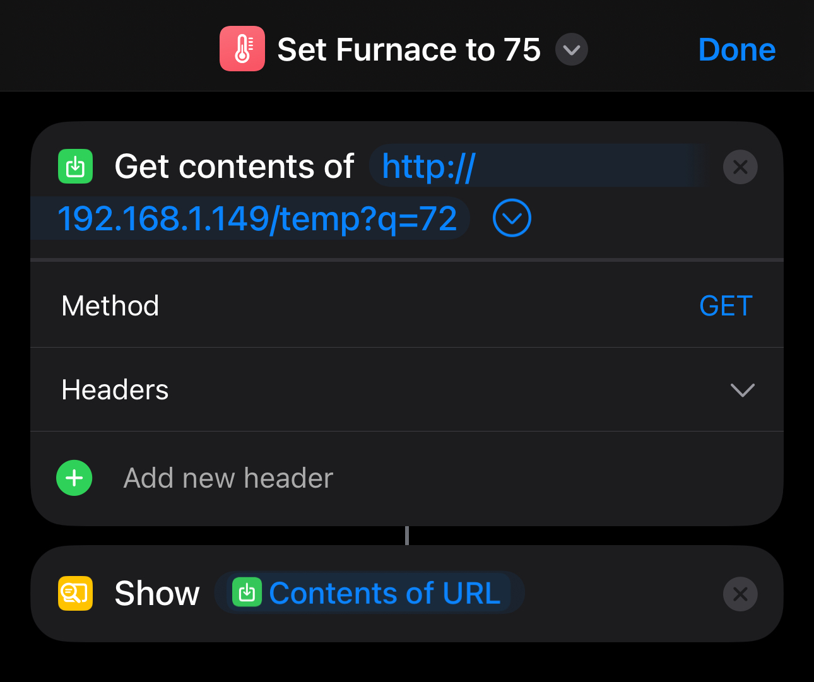

+++
author = "Ryan Wise"
categories = ["Hardware", "Networking"]
tags = ["esp32", "home improvement", "hardware"]
date = "2024-01-23"
description = "Because I'm cheap and I don't like giving my data to large tech companies"
featuredpath = "/assets/img/projects/13dollarthermostat"
featuredalt = "cheap smart thermostat money shot"
featured = "featured.jpg"
linktitle = ""
title = "Weekend Build: Janky 'Smart' Thermostat"
type = "post"

+++

## It's cold and I'm cheap
Michigan winters are a mixed bag of mostly bitter cold with the occasional thaw for a day and freeze into ice sheets at night. I do a lot of work in my pole-barn, which has a monster of a hanging natural gas heating unit. Problem is the old thermostat was not smart, and a little dangerous being mercury based. 

That's why I made this aesthetically abhorrent creation.



Furnaces are pretty simple machines to control, especially old ones like this. This one uses a single wire pair. It has a common wire and a red carrying 24V, when the circuit is closed the furnace turns on. The previous mercury thermostat used a bi-metallic strip of metal in a coil that expands/contracts with temperature. There is a mercury vial with a conductor inside for each wire that is mounted to the coil. As the coil cools down and contracts the vial tilts and the mercury completes the circuit. Turning the temperature set dial changes the tilt of the vial/coil to change when the mercury completes the circuit. 

Here's an example of a mercury thermostat with the coil behind the dial and the vial of mercury on the top.



The monster furnace in question:



It's a Haltech ESP8266 based board with a built in LED I bought off Amazon on sale for less than $10. Add in a DHT22 (originally a DHT11) temperature sensor plus a cheap 5V relay and we have a quick weekend project on our hands.

The relay is connected to the common and 24V wire to complete the circuit by activating a single digital pin on the ESP board.



I hacked together a quick version of the firmware to monitor the current temperature and trigger a relay if it goes below a certain threshold. I added a web-server to change the target temperature and report the current status and temperature/humidity.

Source code at the end because it's very long.


I also added in a restart loop script if it loses WiFi connectivity, it has a max allowed restart variable and will increment a restart counter to the EEPROM every time it restarts. If it doesn't regain WiFi connectivity and it's at the max count it will keep the temperature at the minimum temperature. This is because I still need it to not freeze water in my laser cutter or my sim racing computer. 

And now we have a reliable, cheap albeit ugly 'smart' thermostat.
## Controlling the thermostat
I added a few different methods of controlling the world's worst smart thermostat. 

### Shortcuts on IOS
Apple's shortcuts app is actually pretty good considering their normal views on customization / automation. I've even used it to start up VMs on my computer before when I played video games in a Windows VM. 

These could have been more complicated with multiple steps. I, however, liked the idea of just having a couple shortcuts for setting the high/low temperatures and getting the current status of the thermostat. 



Then I just need to send an HTTP request and view the result.


### Neovim Plugin
Yeah, I'm a neovim evangelist, I won't apologize but I understand your judgement. I wrote a small plugin in lua to send the target temp to the thermostat using this command or a keybind I have mapped.
```
:Heater 70
```

Here's a video of it that I took for TikTok, that's why it has a weird aspect ratio ( I don't actually think VS Code sucks )



## Source Code Time!
Here it is in all of its hackyness!

```C++
/*
  Author: Ryan Wise
  Note: Use at your own risk, this is running on my pole barn and is working fine but do not run untrusted code on your own arduino connected to a furnace.
*/

#include <Wire.h>
#include <WiFi.h>
#include <WiFiClient.h>
#include <WebServer.h>
#include <ESPmDNS.h>
#include "HT_SSD1306Wire.h"
#include <DHT.h>
#include <EEPROM.h>

#define EEPROM_SIZE 1

#define DHTPIN 22
#define DHTTYPE DHT22

#define FURNACE_PIN 27

#define SOFT_RESTART 0
#define HARD_RESTART 1

// NOT recommended: Usually doesn't fix not connecting problem
// Soft Restart: WiFi gets reinitialized
//#define WIFI_ERR_RESTART_TYPE SOFT_RESTART
// Hard Restart: ESP32 restarts
#define WIFI_ERR_RESTART_TYPE HARD_RESTART

SSD1306Wire  display(0x3c, 500000, SDA_OLED, SCL_OLED, GEOMETRY_128_64, RST_OLED); // addr , freq , i2c group , resolution , rst
WebServer server(80);
DHT dht(DHTPIN, DHTTYPE);

String ConnectionState = String("");
String Temp = String("Unknown");
String humidity = String("Unknown");

// START CONFIG
const char* ssid = "your_ssid";
const char* password = "your_password";

const int minTemp = 40;
const int maxTemp = 85;
const int defaultTemp = minTemp;

const int maxRestarts = 8;

// ticks per second
const int tickRate = 1;

// 5 min cooldown time
const int cooldownTimeInSeconds = 15 * 60;
const int maxFurnaceOnTime = 30 * 60; // 30 minutes
// END CONFIG

// hacky fix to make sure the temperture is consistently lower than target for over
// a minute
const int HEAT_ON_COUNT_TO_START = 60;
int heatOnCounter = 0;

// same as above but for heat off
const int HEAT_OFF_COUNT_TO_STOP = 60;
int heatOffCounter = 0;

// START GLOBAL
unsigned long lastTickTime;
int currentTemp = 0;
int targetTemp = defaultTemp;
bool furnaceOn = false;
bool cooldown = false;

// In Seconds
int furnaceOnFor = 0;
int cooldownTimer = 0;
// END GLOBAL

// START EEPROM
int wifiErrorRestarts = 0;
bool automatedRestart = false;
bool hitMaxRestarts = false;
// END EEPROM

void VextON(void)
{
  pinMode(Vext,OUTPUT);
  digitalWrite(Vext, LOW);
}

void VextOFF(void) //Vext default OFF
{
  pinMode(Vext,OUTPUT);
  digitalWrite(Vext, HIGH);
}

void HandleRoot() {
  String output = "";
  output += String("Humidity: ");
  output += humidity + String("\n");
  output += String("Current Temp | Target Temp: \n");
  output += String(Temp) + String("\n");
  String furnaceState;
  if (furnaceOn) {
    furnaceState = String("Furnace On For: ") + furnaceOnFor + String("s\n");
  } else if (cooldown) {
    furnaceState = String("Cooling Down For: ") + cooldownTimer + String("s\n");
  } else {
    furnaceState = "Furnace Off \n";
  }
  output += furnaceState;

  server.send(200, "text/plain", output);
}

void HandleNotFound() {
  server.send(404, "text/plain", "Not found");
}


void HandleTemp() {

  if (server.args() != 1) {
    server.send(400, "application/json", "{\"error\": \"no temp query param passed\"}");
  }

  setTargetTemp(server.arg(0).toInt());

  server.send(200, "application/json", "{\"message\": \"success\"}");    
}

void WriteRestartInfoAndRestart(int restarts, bool automated) {
  Serial.println("Restarts: " + String(restarts));
  int infoByte = 0;
  infoByte = restarts & 0b00001111;
  infoByte = infoByte | (((int)automated & 1) << 4);
  Serial.println("InfoByte: " + String(infoByte));
  EEPROM.write(0, infoByte);
  EEPROM.commit();
  delay(500);
  ESP.restart();
}

void SetupWifi() {
  WiFi.begin(ssid, password);
  Serial.println(String("Connecting to ") + String(ssid));

  updateTemp();

  // Wait for connection
  int dotCount = 0;
  int notConnectedCounter = 0;
  while (WiFi.status() != WL_CONNECTED) {
    vTaskDelay(100);
    Serial.print(".");

    if (dotCount == 8) {
      dotCount = 0;
    }
    if (dotCount == 0) {
      ConnectionState = String("Connecting to: ") + String(ssid);
    }

    ConnectionState = String(ConnectionState)+ String(".");
    dotCount++;
    notConnectedCounter++;


    if (notConnectedCounter > 150) {
      if (WIFI_ERR_RESTART_TYPE == SOFT_RESTART) {
        WiFi.disconnect(true);
        WiFi.begin(ssid, password);
        notConnectedCounter = 0;
        
      } else if (WIFI_ERR_RESTART_TYPE == HARD_RESTART) {
        WriteRestartInfoAndRestart(wifiErrorRestarts+1, true);
      }
    }

    tick();
  }

  Serial.print("Connected to ");
  Serial.println(ssid);
  Serial.print("IP address: ");
  Serial.println(WiFi.localIP());

  ConnectionState = String("Connected: ") + WiFi.localIP().toString();

  if (MDNS.begin("esp32")) {
    Serial.println("MDNS responder started");
  }

  server.on("/", HandleRoot);

  server.on("/temp", HandleTemp);

  server.on("/inline", []() {
    server.send(200, "text/plain", "this works as well");
  });

  server.onNotFound(HandleNotFound);

  server.begin();
  Serial.println("HTTP server started");
}


void heatOn() {
  furnaceOn = true;
  digitalWrite(FURNACE_PIN, HIGH);
}

void heatOff() {
  furnaceOn = false;
  digitalWrite(FURNACE_PIN, LOW);
  furnaceOnFor = 0;
  cooldown = true;
}

void PrintStatus() {
  display.clear();
  display.setFont(ArialMT_Plain_10);
  if (!hitMaxRestarts) {
    display.drawString(0, 0, "Wifi Status: ");
    display.drawString(0, 12, ConnectionState);
  } else {
    display.drawString(0, 0, "Error Connecting!");
    display.drawString(0, 12, "Attempted Restarts: " + String(wifiErrorRestarts));
  }
  
  display.drawString(0, 24, "Current Temp | Target Temp: ");
  display.drawString(0, 36, Temp);

  String furnaceState;
  if (furnaceOn) {
    furnaceState = String("On: ") + furnaceOnFor + String("s HOFFC: ") + heatOffCounter + String("/") + HEAT_OFF_COUNT_TO_STOP + String("s");
  } else if (cooldown) {
    furnaceState = String("Cooling: ") + cooldownTimer + String("/") + cooldownTimeInSeconds;
  } else {
    furnaceState = String("Off. honc: ") + heatOnCounter + String("/") + HEAT_ON_COUNT_TO_START + String("s");
  }

  display.drawString(0, 48, furnaceState);
  display.display();
}

void updateTemp() {
  float t = dht.readTemperature(true);

  float h = dht.readHumidity();

  Serial.println("Temp: ");
  Serial.println(t);

  humidity = String(h, 2) + String("%");

  currentTemp = int(round(t));
  Temp = String(t, 2) + String("F | ") + String(targetTemp) + String("F");
}

void checkFurnace() {
  if (cooldown) {
    cooldownTimer++;
    if (cooldownTimer >= cooldownTimeInSeconds) {
      cooldown = false;
      cooldownTimer = 0;
    }
    return;
  }

  if (furnaceOn) {
    furnaceOnFor++;
    if (currentTemp >= targetTemp) {
      heatOffCounter++;
    } else {
      heatOffCounter = 0;
    }

    if (heatOffCounter >= HEAT_OFF_COUNT_TO_STOP || currentTemp >= 85 || furnaceOnFor > maxFurnaceOnTime) {
      heatOff();
      heatOffCounter = 0;
    }

  } else {
    // if the currently read temp is lower than target
    if (currentTemp < targetTemp) {
      // add one to heat count in order to turn furnace on
      heatOnCounter++;
      if (heatOnCounter >= HEAT_ON_COUNT_TO_START) {
        heatOn();

        // reset heat on counter
        heatOnCounter = 0;
      }
    } else {
      // if the temperture is higher than target, reset the counter
      heatOnCounter = 0;
    }
  }
}

void setTargetTemp(int temp) {
  if (temp > maxTemp) {
    targetTemp = maxTemp;
  } else if (temp < minTemp) {
    targetTemp = minTemp;
  } else {
    targetTemp = temp;
  }
}

void ReadRestartInfo() {

  int infoByte = EEPROM.read(0);
  Serial.println("Info: " + String(infoByte));
  // Account for blank eeprom
  if (infoByte == 255) {
    infoByte = 0;
  }

  wifiErrorRestarts = infoByte & 0b00001111;
  automatedRestart = infoByte >> 4 & 1;
  // hacky way to implement resetting this
  if (!automatedRestart) {
    wifiErrorRestarts = 0;
  }

  if (wifiErrorRestarts >= maxRestarts) {
    hitMaxRestarts = true;
  }

  // Reset to 0 for automatedRestart flag to work
  EEPROM.write(0, 0);
  EEPROM.commit();
  delay(100);  
}


void setup() {
  // Setup display
  display.init();
  display.clear();
  display.display();
  display.setContrast(255);
  
  if (!EEPROM.begin(EEPROM_SIZE)) {
    display.drawString(0, 0, "Can't init EEPROM");
    display.display();
    delay(100000000000);
  };

  Serial.begin(115200);
  Serial.println();

  ReadRestartInfo();
  
  VextON();
  delay(100);

  // Temp Sensor
  dht.begin();

  // Furnace Pin
  pinMode(FURNACE_PIN, OUTPUT);

  if (!hitMaxRestarts) {
    SetupWifi();    
  }

  lastTickTime = millis();
}

void tick() {
  if (millis() - lastTickTime > (1000 / tickRate)) {
    updateTemp();
    checkFurnace();
    PrintStatus();
    lastTickTime = millis();
  }
}

void loop() { 
  delay(5);
  server.handleClient();
  tick();
}
```