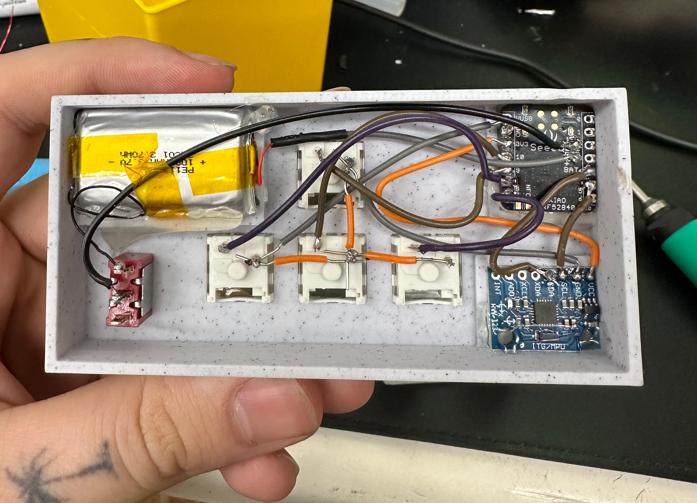
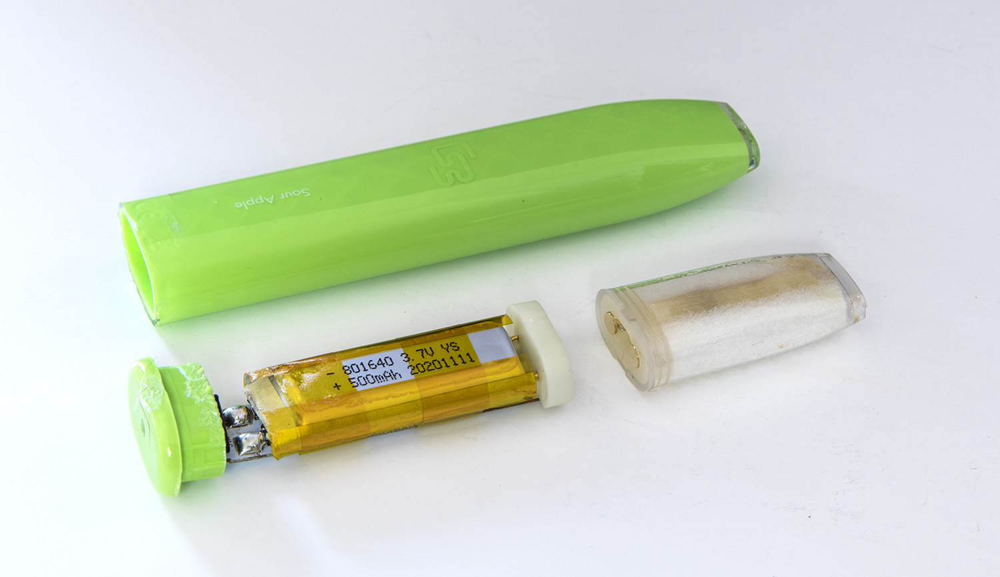

+++
author = "Ryan Wise"
categories = ["Hardware", "Motion Control", "Upcycle"]
tags = ["bluetooth", "gaming", "hid", "battery"]
date = "2024-03-08"
description = "Let's make spreading democracy more immersive!"
featuredpath = "/assets/img/projects/strategemwrist"
featuredalt = "Strategem Wrist Controller"
featured = "featured.jpg"
linktitle = ""
title = "Weekend Builds: Helldivers 2 Strategem Controller"
type = "post"

+++

## Helldivers 2
If you aren't into games or were asleep for early 2024 the game [Helldivers 2](https://store.steampowered.com/agecheck/app/553850/) released in early February to massive success. It's a fun game dressed in a thick coat of satire of military propaganda. You play as a number of 'Helldivers' fighting large hordes of bugs and robots on different planets, to 'spread democracy for Super Earth'. 

It's an engaging co-op game requiring team work, strategy, and a lot of explosions. You regularly call down air-support in the form of 'strategems' these can range from ammo/weapon supply drops, air strikes or even an orbital cannon to crush your foes. To use these strategems you need to enter a string of directional inputs in order. Your in game character does this by bringing up a computer on their wrist to enter the code. I thought it would be fun to design a wireless keyboard to do this. 

## The Strategem Pad ( AKA the Liberkey )
While playing when you want to use a strategem you need to hold down an activation button ( default is ctrl on PC ) to activate your in game wrist computer. My custom controller will automatically hold this key when you bring up your wrist in front of you. This means you just hold up your wrist and enter the code, no holding down a special button. 

I used a cheap gyroscope board off Amazon for detecting the current orientation of the controller to decide when the user has lifted it up and tilted towards them. The controller has an LED that indicates the status of the strategem mode. Red for inactive, green for active. Here's a quick demo of that in action


## The Build
This was a pretty straight forward build consisting of a small micro-controller, mechanical key switches, a gyroscope and an up-cycled disposable vape battery.

Don't look too closely at some of these solder joints, it was in a small case and not my best work. 👉😎👉

### List of Materials
* 1 [Seeed XIAO nRF52840](https://amzn.to/49lbOW1)
* 4 Mechanical key switches ( I used [box jades](https://amzn.to/41jWQxm) )
* 1 [Gyroscope](https://amzn.to/3VoWRfE)
* 1 Disposable vape lithium battery
* 1 [toggle switch](https://amzn.to/49nD9Xy)

### The Micro-controller
I used the [XIAO nRF52840](https://wiki.seeedstudio.com/XIAO_BLE/) for its small size, build in bluetooth, and battery management system. The board has packages for the Arduino IDE which makes writing software over a weekend an absolute breeze. The built in battery management is set it and forget it, you plug into the USB-C port with 5 volts and it'll charge it until full with no extra configuration. Seeed offers a "Sense" version of this board which has a built in gyroscope. However I got sent this one for free by Seeed so I just bought a cheap external one. 

### The Battery ( Plus a Rant on Disposable Vapes )
I retrieved the battery for this project from a disposable vape I found outside while walking around. It's a 3.7V 4.7 Wh lithium ion battery with plenty of life left to give.

We've all seen the common disposable vapes that are sold in every gas-station, convenience store, and smoke shop in the country. Did you know that these vapes are powered by re-chargeable lithium ion batteries? It's true, the only things keeps every single one of these vapes from being reusable are lack of a charging circuit and a way to re-fill the salt-nic vape juice. There are approximately [844 million](https://www.chemistryworld.com/news/disposable-vapes-contribute-to-nearly-10-billion-of-invisible-e-waste-every-year/4018234.article) of these devices thrown away every year. These could have made 5000 electric cars, solar power stores, or any other positive product.

I'm just one person but I try to up-cycle these when I can. I collect from friends, family, the ground if they are just tossed away on the sidewalk or in the grass. You can easily remove the outer casing and pull out the battery. If you decide to follow suit remember these are still lithium batteries and can be dangerous if mishandled or charged incorrectly. 

## Full Demo
I made this video originally for TikTok so there's some cringe lines and talk of a V2 that will never happen at this point



## Source
Source code + case files available on [Github](https://github.com/leobeosab/liberkey)