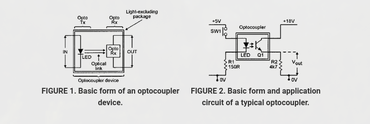
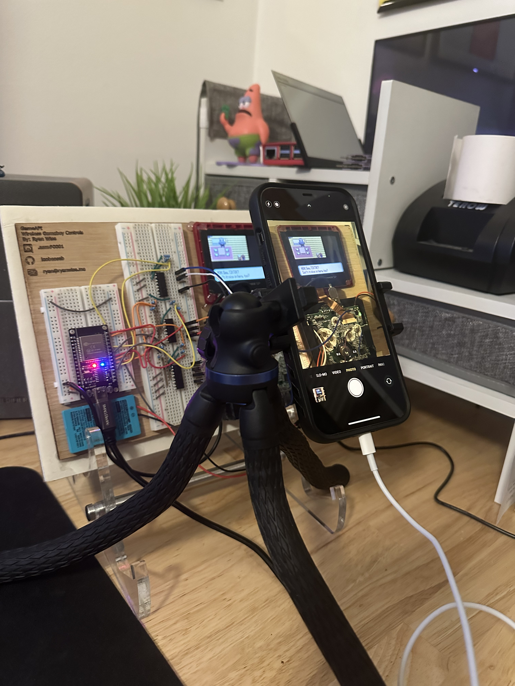

+++
author = "Ryan Wise"
categories = ["Hardware", "Networking"]
tags = ["esp32", "gameboy", "hardware hacking"]
date = "2023-08-23"
description = "You wouldn't want to play on your handheld from your other handheld?"
featuredpath = "/assets/img/projects/wifigameboy"
featuredalt = "WiFi Gameboy"
featured = "wifigb_main.jpg"
linktitle = ""
title = "WiFi Controlled Gameboy"
type = "post"

+++

## Not All Ideas are Good
I had a Gameboy Advance SP laying around with a couple broken buttons and wanted something to do with it. While pondering I happened to glance at my pile of unused ESP32s that I ordered from Aliexpress for a sweet, sweet dopamine hit. 

Ah, I got it. I'll make yet another dumb embedded project with little to no practical use!

I took apart the gameboy and soldered some thin enameled wire to the test pads of the buttons. A lesson in patience, perseverance and burning the shit out of my fingers. 

After soldering the other ends of the wires to a test board with some dupont headers I grabbed an ESP32 and some 4 channel optocouplers from my parts bin. 

[Optocouplers](https://www.nutsvolts.com/magazine/article/optocoupler-circuits) are neat because they allow 1 circuit to complete another just using light. You apply a voltage to the input, which lights an LED inside the optocoupler. The LED's light causes a photo-sensitive element on the other side to lose resistance and complete the other circuit. 

I connected one side of the optocoupler channels to the ESP32 and the other to the headers I added on the gameboy side. Now I could toggle button presses using a `digitalWrite` function call on the ESP32. 

I ~~stole~~ found a simple web-server example from Adafruit and added very rudimentary route checking for the various buttons in the ESP32 firmware. If `http://server/button/a` I'd enable the pin to press `a` and quickly disable.

I edited some HTML/CSS off a sick [gameboy code pen](https://codepen.io/zerratar/pen/zaPZWg), shout out [zerratar](https://codepen.io/zerratar). To make the web-server load a functional gamepad on `http://server/` that would request those routes when the HTML buttons were pressed.

Now we have a functional wireless gameboy

## Twitch Plays but Worse!
Since I have this WiFi gameboy, that means I can hook it up to some automation. What could be better than streaming it to TikTok live and having my followers give it a go. I wrote a quick node script to read command messages from the chat and send HTTP requests to the ESP32.

It worked flawlessly. Haha, no, it was plagued with connection issues due to the flaky nature of the ESP32 and shoddily coded firmware. I made some changes on the fly, during the live, to communicate over serial via USB and that worked much better.

Checkout the source code for the project [here](https://github.com/leobeosab/TikTokLiveGames)